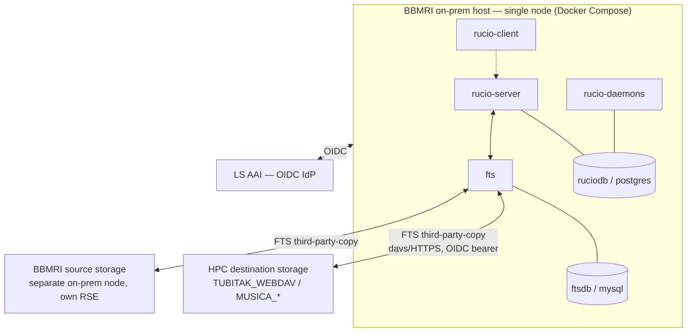

# Deployment view

High-level topology for a BBMRI on-prem deployment: one node running the
full Compose stack, talking out to LS AAI for auth and to existing HPC
storage for transfers. Nothing else needs to run anywhere else.

`rucio-daemons` talks to `ruciodb` directly (SQLAlchemy, same `[database]`
connection string as `rucio-server`) — it doesn't proxy through the REST
API for its DB work.

**Not shown:** this repo's own Teapot/XRootD containers (`TEAPOT1`/
`TEAPOT2`/`XRD3`/`XRD4`). Those exist purely as test fixtures for `make
init`/`make test-rucio-transfers` to validate OIDC/TPC end to end — they
are not the production source. The real BBMRI source, like the HPC
destination, is expected to be **separate on-prem infra, decoupled from
this compose stack** — its own RSE, reached over the network, not a
sibling container in this deployment. See [admin runbook
§5](admin-runbook.md#5-initialize-accounts-rses-quotas) for registering it.

## Systems

| System | Runs where | Role | External? |
|---|---|---|---|
| `rucio-server` | this node | catalog, rule engine, REST API | no |
| `fts` + `ftsdb` | this node | third-party-copy transfer engine | no |
| `rucio-daemons` | this node | conveyor/judge/reaper — drives transfers automatically; connects to `ruciodb` directly | no |
| `rucio-client` | this node | admin/test CLI (see [admin runbook](admin-runbook.md)) | no |
| `ruciodb` | this node | Rucio's Postgres | no |
| LS AAI | external | OIDC identity provider — the only external auth dependency | **yes** |
| Source RSE (BBMRI data holding) | separate on-prem node (BBMRI's own infra) | where the data actually lives before transfer — not the same node/container as this Compose stack, and not the test-fixture Teapot/XRootD RSEs | **yes**, relative to this node |
| Destination RSE (TUBITAK/MUSICA) | operated by TUBITAK/ASC | HPC compute-adjacent storage, reached via FTS TPC only | **yes** |

This node never touches file bytes directly for a transfer — FTS moves data
storage-to-storage between the source and destination RSEs; Rucio only
orchestrates (catalog + rule + token flow). See
[Known Destination RSEs](known-destination-rses.md) for the TUBITAK/MUSICA
configs and what it takes to point this node's own `fts` at them.
